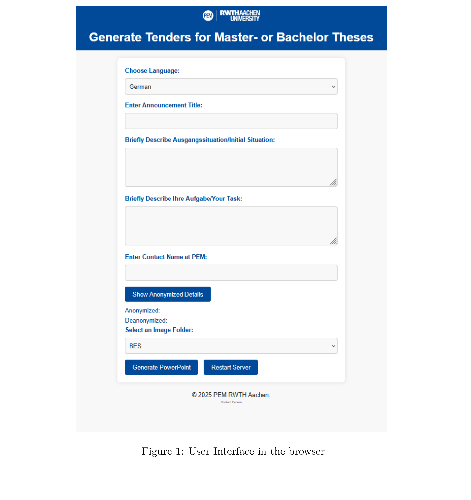
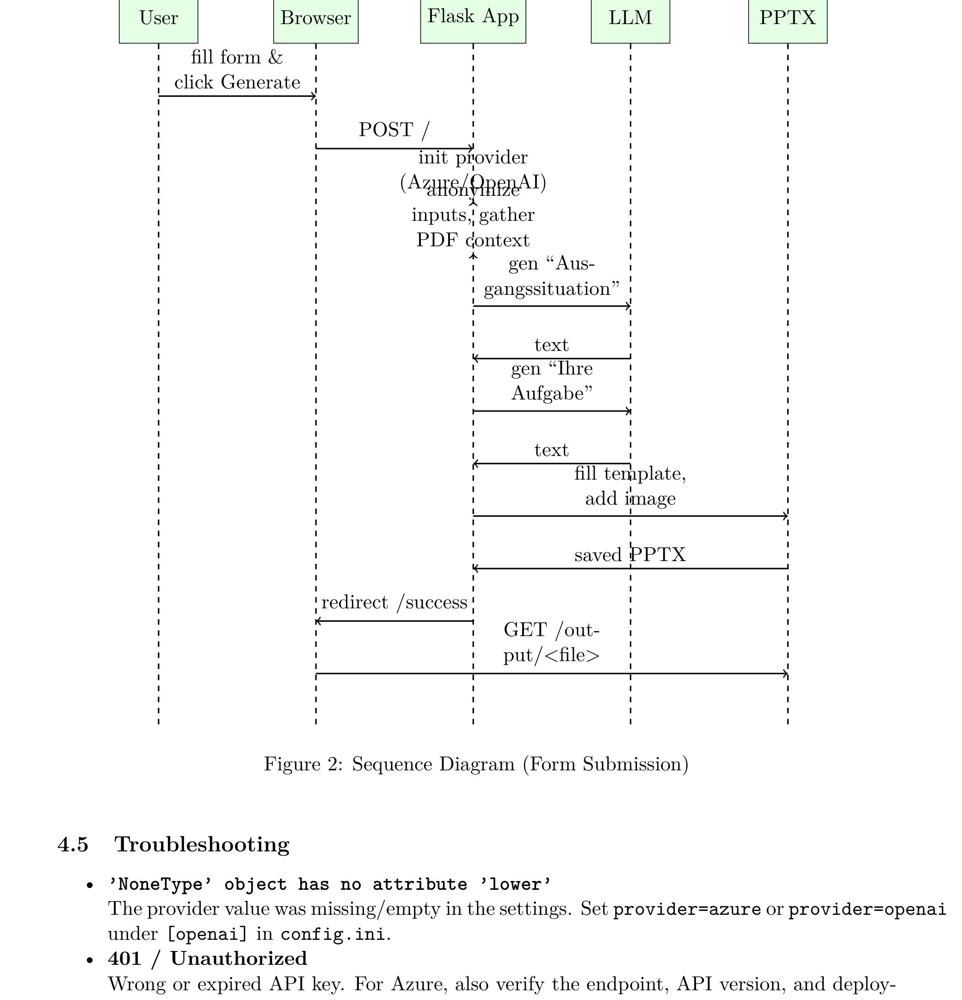
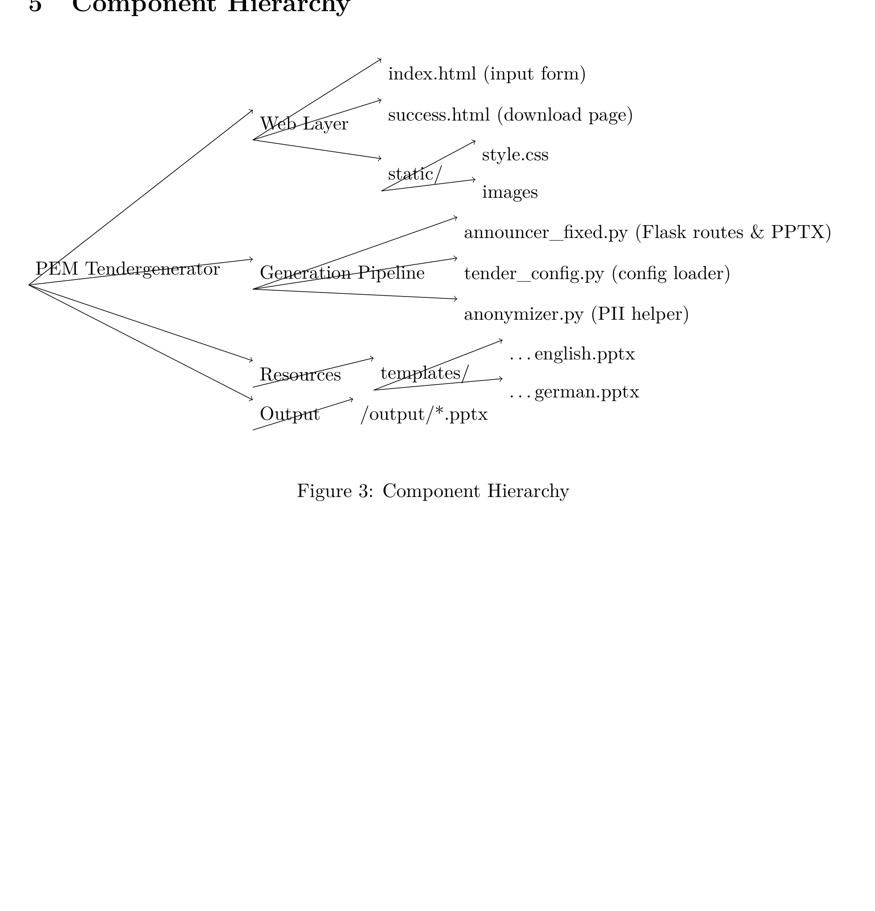

# AI-based Tendergenerator for Master’s/Bachelor’s Theses

A **public showcase repository** for an AI-assisted PowerPoint tender generator that automates the creation of professional thesis postings for Bachelor’s and Master’s theses.

> This repository is an **evidence layer**: it documents the product, workflows, architecture and engineering quality **without exposing the proprietary source code**.

## Problem
Creating branded thesis tenders manually is repetitive and error-prone. Staff members often need to rewrite short input text into well-structured, presentation-ready content, fill a PowerPoint template, select the correct language version and produce a clean final file for distribution.

## Solution
The Tendergenerator turns a small set of structured browser inputs into a finished PowerPoint tender:
- title,
- two short text fields (*Initial Situation* / *Your Task*),
- language selection (DE/EN),
- PEM contact name,
- optional image folder.

The application then:
1. validates and structures the form data,
2. pseudonymizes the contact name before model usage,
3. optionally gathers context from publicly accessible thesis postings,
4. uses an LLM to generate concise tender-ready text,
5. selects the proper DE/EN PowerPoint template,
6. inserts content and an optional image into the template,
7. saves a timestamped `.pptx` file and provides it for download.

## Why this project is strong for employers
This project shows:
- end-to-end product engineering,
- browser-based workflow design,
- AI-assisted business document generation,
- privacy-aware handling of personal data,
- configuration-driven deployment,
- template-based PowerPoint automation,
- practical separation between UI, orchestration, anonymization, generation and rendering.

## Architecture evidence
### Browser UI

### Sequence diagram

### Component hierarchy

## Repository contents
- `README.md` – project overview
- `docs/index.html` – GitHub Pages-ready portfolio landing page
- `docs/architecture.md` – technical structure and high-level flow
- `docs/user-workflows.md` – end-user and admin workflows
- `docs/deployment-and-operations.md` – install, config and runtime operations
- `docs/security-and-privacy.md` – privacy model and public-safe security notes
- `docs/performance-and-scalability.md` – operational characteristics and scaling notes
- `docs/results.md` – measurable value and quality outcomes
- `docs/demo.md` – demo/release strategy guidance
- `docs/engineering-boundaries.md` – what is intentionally not disclosed
- `docs/portfolio-evidence.md` – hiring-oriented engineering evidence
- `docs/release-and-provenance.md` – recommended release and integrity workflow
- `docs/recruiter-review-guide.md` – quick reviewer summary
- `docs/github-profile-snippet.md` – profile README snippet
- `docs/diagram-provenance.md` – origin of included diagrams
- `CHANGELOG.md`, `LICENSE.md`, `NOTICE.md`, `MANIFEST.txt`
- `releases/v1.0.0/*` – release-note and provenance templates

## Public-safe boundaries
This repository intentionally does **not** include:
- proprietary source code,
- internal prompt implementations,
- templates or mappings in reusable internal detail,
- API keys, `.env` values or infrastructure details,
- sensitive institutional or personal data,
- anything that would allow trivial 1:1 reconstruction.

## Author
**Martin Khadjavian**  
Copyright © Martin Khadjavian
